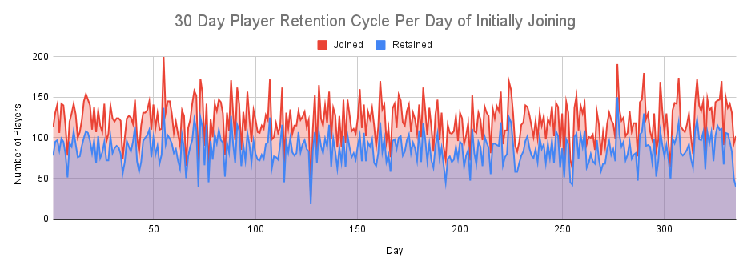
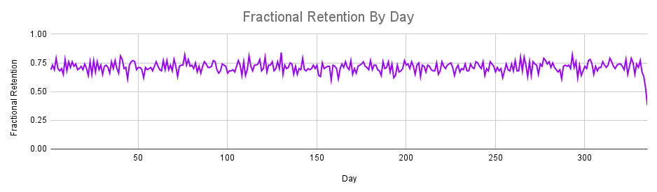
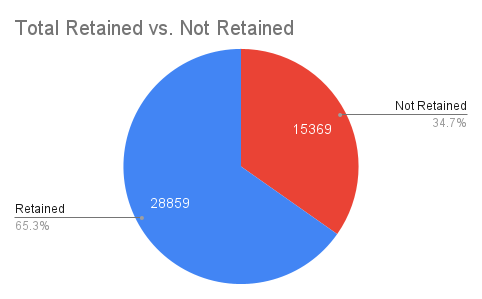
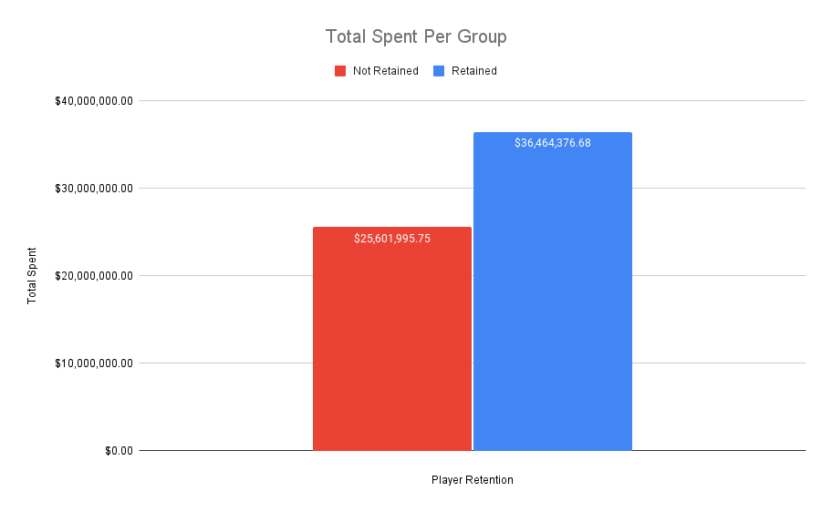
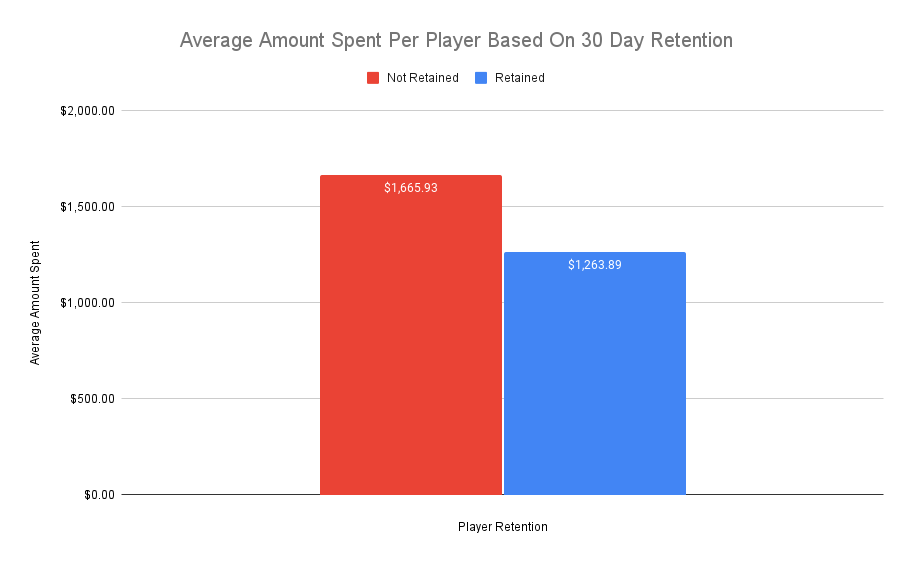
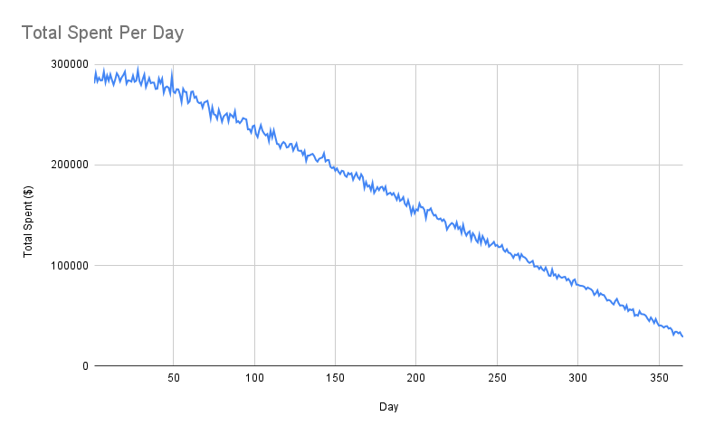

# MOBILE VIDEO GAME RETENTION STUDY

We were given four tables in order to analyze various outcomes of a mobile video game over the course of one year. Our primary interest was to explore spending habits in relation to a 30-day retention cycle. To conduct this study, we asked the following questions using SQL:

1. What was the 30-day retention cycle over the course of one year?
2. What was the average amount of money spent per player, based on whether they were retained or not retained. 
3. Are players who win more retained more?
 
 

## QUESTION 1) THE 30 DAY  RETENTION  CYCLE

For each individual day of the year we calculated the following: 

- the day of the year a player joined
- the total number of players who joined on a given day
- of the number of players who joined, how many were retained
-  the fractional retention; calculating what percentage of players who joined on a given day were retained after 30 days of joining. 

These calculations were then displayed in a table and a graph:

### TABLE 1.

|day|num_joined|num_retained|fractional_retention|
|---|---|---|---|
|1  |   113|  78 | 0.69  |
| 2  |  131 |  95 | 0.73  |
|3   | 141 |  97 |  0.69 |  

 
 

### ANALYSIS
The graphs below shows that over the course of one year the 30-day retention cycle was strong, with an average daily retention rate of 71.1% when calculated for days where 30-day retention was not limited by there being less than 30 days to the end of the 365 day macro cycle.

 
 

                                                                                                                                                            
 
 

## QUESTION 2) SPENDING HABITS OF PLAYERS BASED ON RETENTION
 
 

 The player retained vs. non-retained was analyzed with both total amount spent and the average spent. Comparing the two graphs there is a very noticeable observation. The total spent by retained players is $10,862,381 more than non-retained players but the average spent by retained players is $402 less than non-retained players. It was clear that the possibility of retained players spending more was almost certain, given that 65.3% of total players were retained, but the curiosity lies within the average spent of each group. This occurrence could have to do with play time reduction from in-game purchases; meaning purchased items that can help players complete the objectives of the game before the 30 day mark could be an explanation as to why players were not retained but still spent more on average.

  
  

 

 

  

 
 

### A DEEPER LOOK INTO SPENDING

 The *Total Spent Per Day* graph can be described as almost being a negative sloping function. The graphs begins by slowly curving downward then consistently decreases as days go by. When looking at the negative slop there is very little evidence to prove why this is happening especially knowing total players joined per day remains consistent at an average of 121. By focusing on the first 50 days the total spent results in $14,174,185, which is 30% of the total spent of 47,892,189. This can further prove the the previous assumption of non-retained players spending more on average. The players used in-game purchases to speed up the play time of the game and could be a result of them not being playing for a longer period of time and thus, not being retained.

  

 
 
